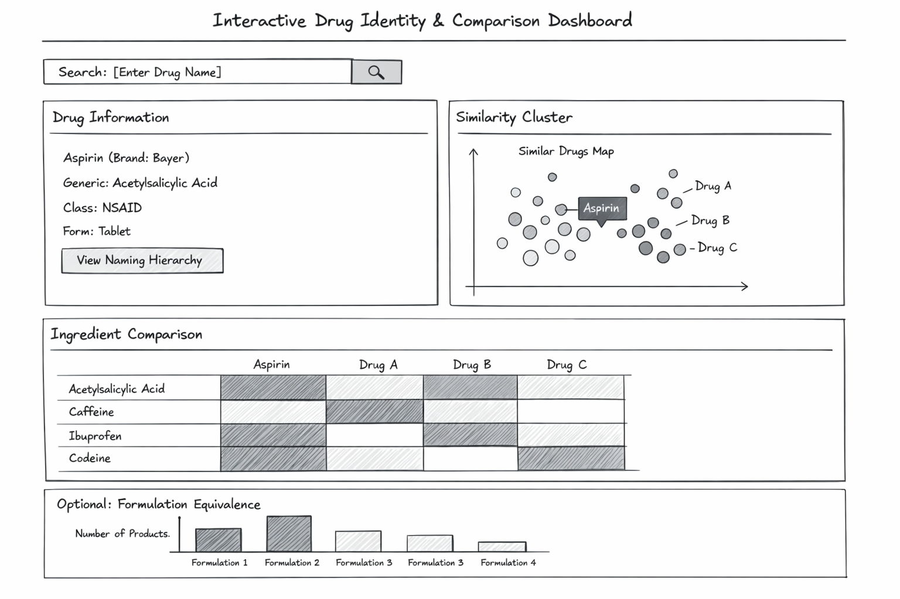

# Interactive Drug Identity & Comparison Dashboard

## Overview

This project builds an interactive dashboard designed to clarify drug identity and compare formulations using standardized terminology from RxNorm. The goal of the app is not to provide medical advice, but to help users understand whether different drug products are truly distinct or simply marketed under different names.

Consumers frequently encounter multiple brand names for the same active ingredient, combination products that appear unique but share similar components, and confusion surrounding generic versus brand-name equivalence. This dashboard addresses the question:

> “Are these drugs actually different, or simply marketed differently?”

The app focuses on formulation transparency and structural comparison through coordinated multi-panel visualization.

------------------------------------------------------------------------

## High-Level Interface Design

The interface begins with a search bar where users can enter a brand name, generic name, or active ingredient. The system normalizes the input to a standardized RxNorm identity and retrieves associated ingredient and formulation information.

After a search is submitted, three coordinated panels are displayed:

### Panel A — Drug Information Panel

This panel provides a concise summary of the selected drug, including:

-   Brand and generic names\
-   Active ingredient(s)\
-   Pharmacologic class\
-   Formulation type (single vs. combination)

Users can optionally expand a naming hierarchy view that maps Ingredient → Generic → Brand relationships to clarify naming redundancy.

------------------------------------------------------------------------

### Panel B — Similarity Cluster View

A 2D similarity map visualizes related drugs based on ingredient composition. The searched drug is highlighted as the anchor point, and nearby drugs can be selected for further comparison. This panel supports exploratory discovery and contextual understanding of formulation similarity.

------------------------------------------------------------------------

### Panel C — Ingredient Heatmap Comparison

When multiple drugs are selected, an ingredient comparison heatmap is displayed:

-   Rows represent selected drugs\
-   Columns represent active ingredients\
-   Cell shading indicates ingredient presence

This allows users to quickly identify overlapping or distinct formulations.

------------------------------------------------------------------------

### Optional — Formulation Equivalence Summary

An optional bar chart summarizes how many distinct formulation groups exist within a product family, highlighting structural redundancy across marketed products.

------------------------------------------------------------------------

## Data Sources

-   **RxNorm** – standardized drug identity and ingredient mapping\
-   **RxClass** – pharmacologic class metadata

The app uses structured ingredient relationships to compute similarity and visualize formulation overlap.

------------------------------------------------------------------------

## App Sketch

The following sketch illustrates the planned layout and interaction flow of the dashboard:

{width="1000"}

------------------------------------------------------------------------

## One-Sentence Summary

An interactive dashboard that uses RxNorm to clarify drug identity, visualize formulation similarity, and reduce brand-based confusion through structured comparison tools.
