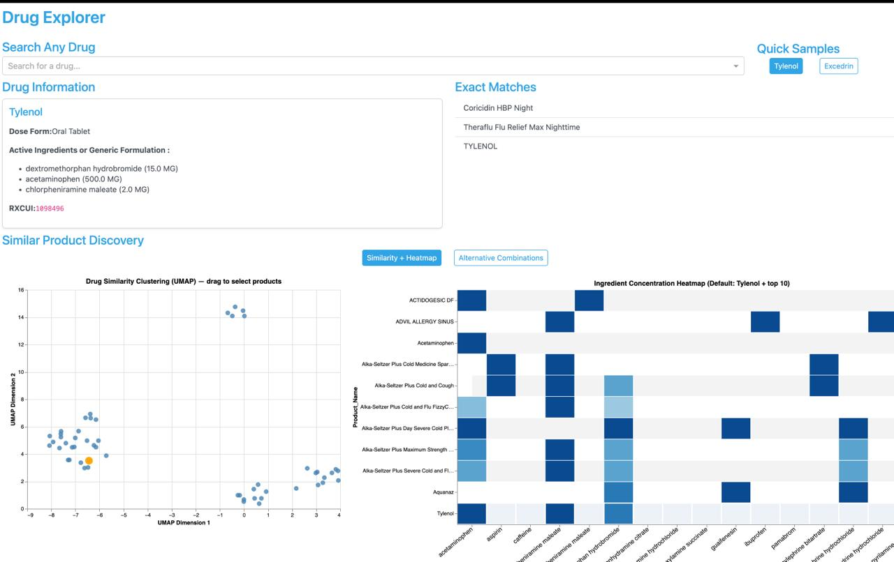

# Interactive Drug Identity & Comparison Dashboard

## Overview

This project builds an interactive dashboard designed to clarify drug identity and compare formulations using standardized terminology from RxNorm. The goal of the app is not to provide medical advice, but to help users understand whether different drug products are truly distinct or simply marketed under different names.

Consumers frequently encounter multiple brand names for the same active ingredient, combination products that appear unique but share similar components, and confusion surrounding generic versus brand-name equivalence. This dashboard addresses the question:

> “Are these drugs actually different, or simply marketed differently?”

The app focuses on formulation transparency and structural comparison through coordinated multi-panel visualization.

------------------------------------------------------------------------

## High-Level Interface Design

The interface begins with a search bar and a Quick Sample with selective Drugs. The Search bar can be used to enter a brand name, generic name, or active ingredient. The system normalizes the input to a standardized RxNorm identity and retrieves associated ingredient and formulation information.

The Quick Samples Layout provides predefined drug examples that bypasses the search process and immediately displays the comparision results, allowing users to understand how the system identifies drugs with identical and similar active ingredients. This feature improves usability by helping first-time users explore the tool’s functionality and visualize the results instantly.

After a search or Quick Sample is selected, three coordinated panels are displayed:

### Panel A — Drug Information Panel

This panel provides a concise summary of the selected drug, including:

-   Brand and generic names
-   Dose Form
-   Active ingredient(s) and their Dosage
-   RXCUI ID (Reference ID used by the RXNORM dataset)

Users can optionally expand a naming hierarchy view that maps Ingredient → Generic → Brand relationships to clarify naming redundancy.

------------------------------------------------------------------------

### Panel B — Exact Matches Panel

Displays a list of all the drugs with the exact same ingredients and Dosage as the Drug selected by the user. This display the first 5 drugs and also contains a toggle switch to view all the Exact matches if the list exceeds 5.

------------------------------------------------------------------------

### Panel C — Similar Product Discovery Panel

This Panel contains two subpanels namely:

-   Similarity + Heatmap
-   Alternative Combinations

The User can quickly Switch between these two Subpanels at will.

------------------------------------------------------------------------

### Sub Panel C1

This SubPanel contains two charts:

-   Umap Cluster
-   Heatmap

The Umap maps all the Drugs to a 2D chart based on Similarity of Drug ingredients and Dose Forms, while the Heatmaps has two states (default and specific). The Umap and Heatmap showcase Interplot Functionality defined by altair, where the Heatmap in the default state displays the Top 10 Drugs Similar Drugs and in the Specific State display the drugs selected by the Umap to help to user better understand the relatinships between the drugs of their choice. 

------------------------------------------------------------------------

### Sub Panel C2

The Alternative Combinations Panel contains two bar charts:

-   Unique Ingredients Bar chart
-   Unique Combinations Bar chart

This SubPanel shows the user an additional set of information about the frequency of each unique ingredient and also a frequency chart of all the important combinations between those ingredients.

------------------------------------------------------------------------

## Data Sources

-   **RxNorm** – standardized drug identity and ingredient mapping
-   **RxClass** – pharmacologic class metadata (optional; require api call)

The app uses structured ingredient relationships to compute similarity and visualize formulation overlap.

------------------------------------------------------------------------

## Dashboard Preview

The following image illustrates the final version of the Med-Compare Dashboard:

## Deployment

The Dashboard has been deployed in Render to make our Med-Compare project accessible to everyone.

Feel free to view our deployed version on 
